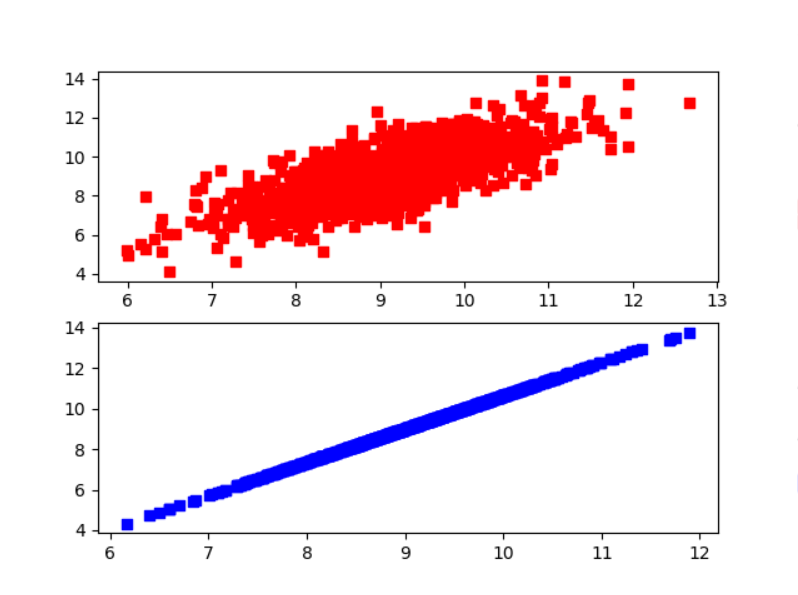
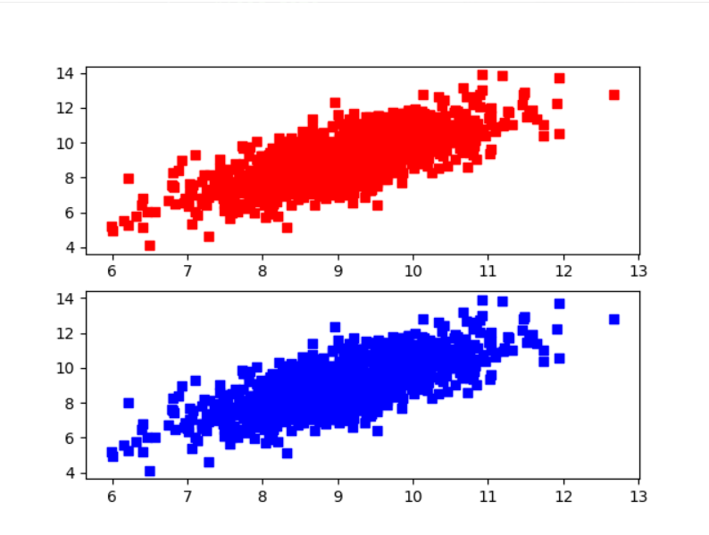
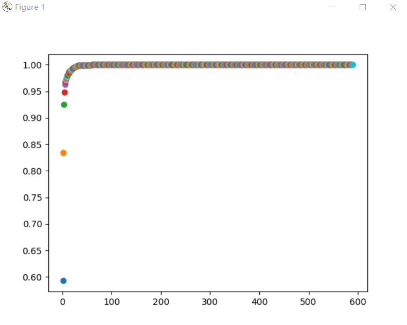

# HW 4

### 4.1

> 利用PCA函数，对testSet.txt中数据做降维分析：
>
> （1）可视化topNfeat分别等于1、2时，PCA的输出数据；
>
> （2）通过与原始数据对比，讨论topNfeat分别等于1、2时的降维效果；

利用以下代码进行拟合：

```python
import numpy as np
from sklearn.decomposition import PCA
import matplotlib.pyplot as plt

#load data
data = np.loadtxt('4.1/testSet.txt',delimiter='	')

#fit model
model = PCA(n_components=1)
newRes = model.fit_transform(data)
invRes = model.inverse_transform(newRes)
print(invRes)

#draw
fig = plt.figure()
ax1 = fig.add_subplot(211)
ax2 = fig.add_subplot(212)
ax1.scatter(data[:,0],data[:,1],marker='s',s=40,color='red')
ax2 = plt.scatter(invRes[:,0],invRes[:,1],marker='s',s=40,color='blue')
plt.show()
```

当n_components=1时得到的图如下：



当n_components=2时得到的图如下：



### 4.2

> 利用PCA，对secom.data数据降维，（1）讨论topNfeat取值对降维数据的影响；（2）找到降维后恢复的数据与原始数据相对误差小于9%的topNfeat；

使用如下代码进行寻找

```python
from cmath import isnan
from turtle import color
import numpy as np
from sklearn.decomposition import PCA
import matplotlib.pyplot as plt

#load data
data = np.loadtxt('4.2/secom.txt',delimiter=' ')

#处理缺失值
for i in range(data.shape[1]):
    tempCol = data[:,i]
    nanNum = np.count_nonzero(np.isnan(tempCol))
    if(nanNum != 0):
        tempCol[np.isnan(tempCol)] = np.mean(tempCol[~np.isnan(tempCol)])
    data[:,i] = tempCol

#fit model
model = PCA(n_components=3)
newRes = model.fit_transform(data)
invRes = model.inverse_transform(newRes)

res = 0
flag = 0
for i in range(data.shape[1]):
    tmpModel = PCA(n_components=i+1)
    tmpRes = tmpModel.fit_transform(data)
    y = np.sum(tmpModel.explained_variance_ratio_)
    plt.plot(i+1,y,color="red")
    if(y > 0.91 and flag == 0):
        res = i+1
        flag = 1
    
plt.show()
print(res)
```

当topNfeat增大时，相对误差减少；当topNfeat ≥ 3时，相对误差小于9%



