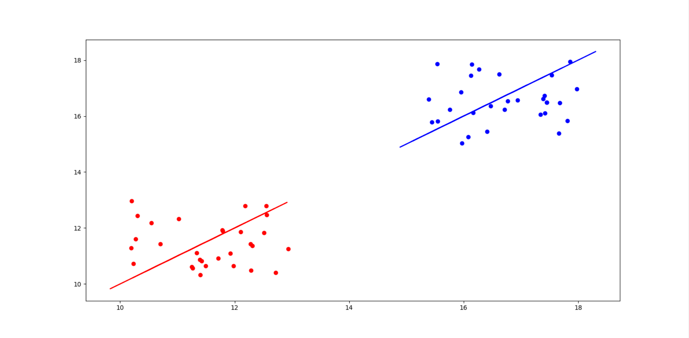

# HW 5

> 利用np.random.random函数，生成两个类别的随机数据，样本大小为30*2（行表示样本数，2表示特征数），其中随机数A的取值范围为10-13，随机数据B的取值范围为15-18；通过LDA对生成的随机数据进行降维，并在同一张图内可视化降维直线和原始数据。

### 算法流程

1. 计算类内散度矩阵$S_b$
2. 计算类间散度矩阵$S_w$
3. 计算矩阵$S_w^{-1}S_b$
4. 对矩阵$S_w^{-1}S_b$进行特征分解，计算最大的d个最大特征值对应的特征向量组成W
5. 计算投影后的数据点$Y = W^TX$

给定数据集$D = (x_i,y_i),y_i\in(0或1),N_i,X_i,u_i,\sum_i分别表示第i\in(0或1)类示例的样本个数，样本集合，均值向量，协方差矩阵$

$u_i = \frac{1}{N_i}\sum x$

$\sum_i = \sum (x-u_i)(x-u_i)^T$

$S_b = (u_0-u_1)(u_0-u_1)^T$

$S_w = \sum_0 + \sum_1$

### 生成数据

使用如下代码随机生成数据

```python
def createData():
    A = np.random.uniform(low=10,high=13,size=(30,2))
    B = np.random.uniform(low=15,high=18,size=(30,2))

    return A,B
```

### 计算$S_w与S_b$

使用如下代码

1. 计算类内散度矩阵$S_b$
2. 计算类间散度矩阵$S_w$

```python
def myLDA(A,B):
    A_1 = np.mean(A,axis=0)
    B_1 = np.mean(B,axis=0)
    Sw1 = np.dot((A-A_1).T,(A-A_1))
    Sw2 = np.dot((B-B_1).T,(B-B_1))
    Sw = Sw1 + Sw2
    tmp = np.array(A_1-B_1)
    Sb = np.dot(tmp.reshape(2,1),tmp.reshape(1,2))
    #获得Sw^-1 * Sb
    res = np.dot(np.linalg.inv(Sw),(Sb))
```

### 获得w

对矩阵$S_w^{-1}S_b$进行特征分解，计算最大的d个最大特征值对应的特征向量组成W

```python
    #获得特征值和特征向量
    eig_value,eig_vector = np.linalg.eig(res)
    #获得特征值排序
    idx = eig_value.argsort()[::-1]
    w = eig_vector[:,idx[0]]
```

### A，B映射

计算投影后的数据点$Y = W^TX$

```python
    Anew = np.zeros((30,2))
    for i in range(len(A)):
        Anew[i] = np.dot(w.reshape(1,2),A[i].reshape(2,1))
    #获取w^T * B
    Bnew = np.zeros((30,2))
    for i in range(len(B)):
        Bnew[i] = np.dot(w.reshape(1,2),B[i].reshape(2,1))
```

### 画图

```python
    plt.plot(Anew[:,0],Anew[:,1],color='red')
    plt.plot(Bnew[:,0],Bnew[:,1],color='blue')
    plt.plot(A[:,0],A[:,1],'ro')
    plt.plot(B[:,0],B[:,1],'bo')
    plt.show()
```

### 结果



### 完整代码

```python
from turtle import color
import numpy as np
import matplotlib.pyplot as plt
from sklearn.decomposition import LatentDirichletAllocation

def createData():
    A = np.random.uniform(low=10,high=13,size=(30,2))
    B = np.random.uniform(low=15,high=18,size=(30,2))

    return A,B

def train(A,B):
    lda = LatentDirichletAllocation(n_components=2,max_iter=3,
                                    learning_method='online',learning_offset=500.,
                                    random_state=0)
    Anew = lda.fit_transform(A)
    Bnew = lda.fit_transform(B)
    return Anew,Bnew

def myLDA(A,B):
    A_1 = np.mean(A,axis=0)
    B_1 = np.mean(B,axis=0)
    Sw1 = np.dot((A-A_1).T,(A-A_1))
    Sw2 = np.dot((B-B_1).T,(B-B_1))
    Sw = Sw1 + Sw2
    tmp = np.array(A_1-B_1)
    Sb = np.dot(tmp.reshape(2,1),tmp.reshape(1,2))
    #获得Sw^-1 * Sb
    res = np.dot(np.linalg.inv(Sw),(Sb))
    #获得特征值和特征向量
    eig_value,eig_vector = np.linalg.eig(res)
    #获得特征值排序
    idx = eig_value.argsort()[::-1]
    w = eig_vector[:,idx[0]]
    #获取w^T * A
    Anew = np.zeros((30,2))
    for i in range(len(A)):
        Anew[i] = np.dot(w.reshape(1,2),A[i].reshape(2,1))
    #获取w^T * B
    Bnew = np.zeros((30,2))
    for i in range(len(B)):
        Bnew[i] = np.dot(w.reshape(1,2),B[i].reshape(2,1))
    plt.plot(Anew[:,0],Anew[:,1],color='red')
    plt.plot(Bnew[:,0],Bnew[:,1],color='blue')
    plt.plot(A[:,0],A[:,1],'ro')
    plt.plot(B[:,0],B[:,1],'bo')
    plt.show()

def plot(A,B,Anew,Bnew):
    fig = plt.figure()
    ax1 = fig.add_subplot(211)
    ax2 = fig.add_subplot(212)
    ax1.plot(A[:,0],A[:,1],'ro')
    ax1.plot(B[:,0],B[:,1],'bo')
    ax2.plot(Anew[:,0],Anew[:,1],color='red')
    ax2.plot(Bnew[:,0],Bnew[:,1],color='blue')
    plt.show()

def main():
    A,B = createData()
    #Anew,Bnew = train(A,B)
    #plot(A,B,Anew,Bnew)
    myLDA(A,B)

main()
```

