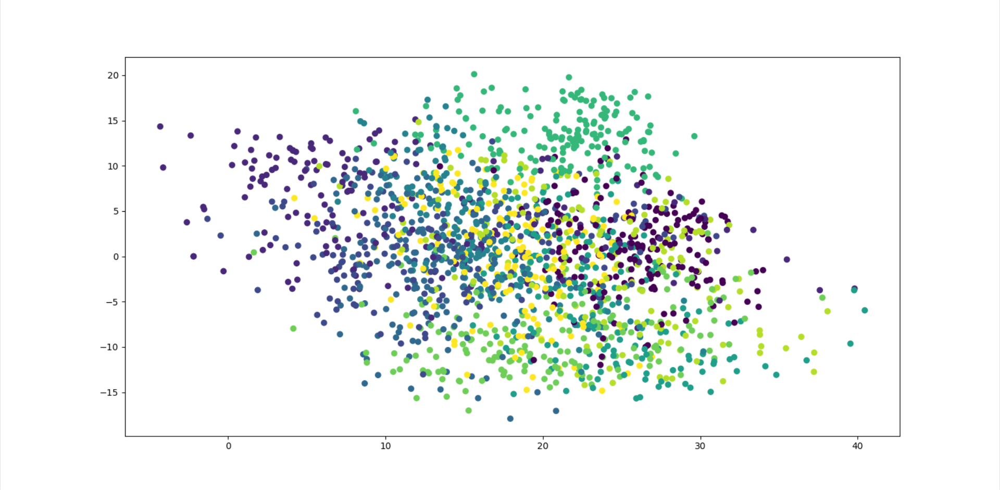

# HW 6

> 利用sklearn.datasets.load_digits函数，导入手写数字数据集作为数据集，通过LPP对生成的随机数据进行降维（n_dim=2），并可视化降维后的数据

使用如下代码计算W：

```python
def cal_W(data, n_neighbors = 10, t = 1):
    sum_x = np.sum(np.square(data),1)
    dist = np.add(np.add(-2 * np.dot(data, data.T), sum_x).T, sum_x)
    #rbf_dist = rbf(dist, t)
    rbf_dist = np.exp(-dist/t)
    n = dist.shape[0]
    W = np.zeros((n, n))
    for i in range(n):
        index = np.argsort(dist[i])[1:1 + n_neighbors]
        W[i, index] = rbf_dist[i, index]
        W[index, i] = rbf_dist[index, i]
    return W
```

使用如下代码进行LPP降维

```python
def myLPP(data, n_dims = 2, n_neighbors = 30, t = 1.0):
    N = data.shape[0]
    W = cal_W(data, n_neighbors, t)
    D = np.zeros_like(W)
    for i in range(N):
        D[i,i] = np.sum(W[i])
    L = D - W
    #计算XDX^T
    XDXT = np.dot(np.dot(data.T, D), data)
    #计算XLX^T
    XLXT = np.dot(np.dot(data.T, L), data)
    #特征值分解
    eig_val, eig_vec = np.linalg.eig(np.dot(np.linalg.pinv(XDXT), XLXT))
    #排序
    sort_index_ = np.argsort(np.abs(eig_val))
    eig_val = eig_val[sort_index_]
    #找出前n'个最小非零特征值对应的特征向量
    flag = 0
    for i in range(len(eig_val)):
        if(eig_val[i] < 1e-5):
            flag += 1
    #eig_val_res = eig_val[flag:flag+n_dims]
    index_res = sort_index_[flag:flag+n_dims]
    eig_vec_res = eig_vec[:,index_res]
    res = np.dot(data, eig_vec_res)
    return res
```

在主函数中调用LPP函数，并将其可视化

```python
def main():
    data,labels = load_data()
    data_lpp = myLPP(
        data,
        n_neighbors=5,
        t = 1
    )
    plt.scatter(data_lpp[:,0], data_lpp[:,1],c=labels)
    plt.show()
```

得到的结果如下：



### 附录

完整代码如下

```python
from sklearn.datasets import load_digits
import numpy as np
import matplotlib.pyplot as plt

def load_data():
    digits = load_digits()
    data = digits.data
    label = digits.target
    return data, label

def cal_W(data, n_neighbors = 10, t = 1):
    sum_x = np.sum(np.square(data),1)
    dist = np.add(np.add(-2 * np.dot(data, data.T), sum_x).T, sum_x)
    #rbf_dist = rbf(dist, t)
    rbf_dist = np.exp(-dist/t)
    n = dist.shape[0]
    W = np.zeros((n, n))
    for i in range(n):
        index = np.argsort(dist[i])[1:1 + n_neighbors]
        W[i, index] = rbf_dist[i, index]
        W[index, i] = rbf_dist[index, i]
    return W

def myLPP(data, n_dims = 2, n_neighbors = 30, t = 1.0):
    N = data.shape[0]
    W = cal_W(data, n_neighbors, t)
    D = np.zeros_like(W)
    for i in range(N):
        D[i,i] = np.sum(W[i])
    L = D - W
    #计算XDX^T
    XDXT = np.dot(np.dot(data.T, D), data)
    #计算XLX^T
    XLXT = np.dot(np.dot(data.T, L), data)
    #特征值分解
    eig_val, eig_vec = np.linalg.eig(np.dot(np.linalg.pinv(XDXT), XLXT))
    #排序
    sort_index_ = np.argsort(np.abs(eig_val))
    eig_val = eig_val[sort_index_]
    #找出前n'个最小非零特征值对应的特征向量
    flag = 0
    for i in range(len(eig_val)):
        if(eig_val[i] < 1e-5):
            flag += 1
    #eig_val_res = eig_val[flag:flag+n_dims]
    index_res = sort_index_[flag:flag+n_dims]
    eig_vec_res = eig_vec[:,index_res]
    res = np.dot(data, eig_vec_res)
    return res

def main():
    data,labels = load_data()
    data_lpp = myLPP(
        data,
        n_neighbors=5,
        t = 1
    )
    plt.scatter(data_lpp[:,0], data_lpp[:,1],c=labels)
    plt.show()


main()
```

