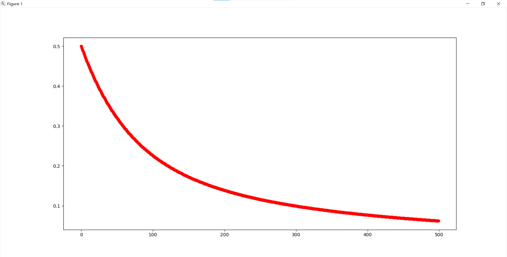
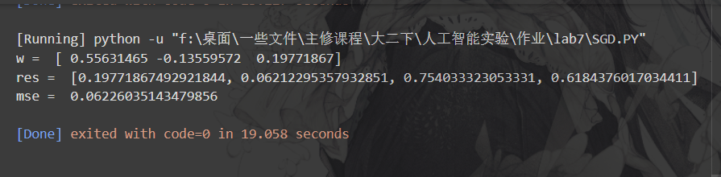
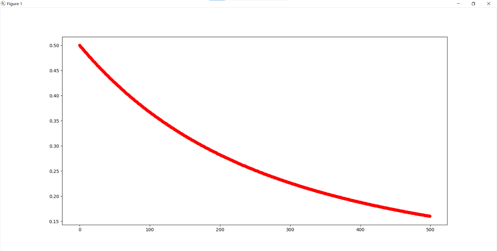
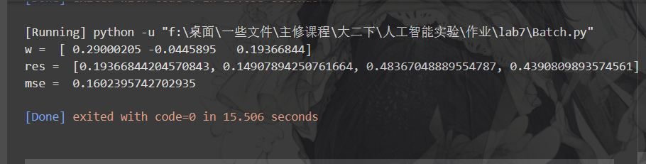

# HW 7

> - 通过SGD训练方法及Delta 规则，对上述神经网络进行训练，并输出训练后的结果。
>
> - 通过Batch训练方法及Delta 规则，对上述神经网络进行训练，并输出训练后的结果。
>
> - 比较SGD训练方法及Batch训练方法误差(真实结果与输出的MSE)随epoch变化趋势，并可视化结果。

## SGD

### 原理

$$
w_i -->w_i+\alpha \phi(v_i)(1-\phi(v_i))e_ix_j\\
\phi(x)为sigmoid函数,\alpha为学习率,e_i为误差,x_j为当前对应的输入
$$

### 代码

使用如下sgd函数更新w

```python
def sgd(w_current,learning_rate,gradient,x_current):
    """
    :param w_current: 当前权重
    :param learning_rate: 学习率
    :param gradient: 梯度
    :param x_current: 当前样本
    :return: 更新后的权重
    """
    w_new = w_current + learning_rate * gradient*x_current
    return w_new
```

由于使用sigmoid作为激活函数，采用如下函数计算梯度

```python
def calculateDw(y_predict,y,x_i):
    """
    :param y_predict: 预测值
    :param y: 真实值
    :param x_i: 当前样本
    :return: 梯度
    """
    dw = sigmoid(y_predict)*(1-sigmoid(y_predict))*(y-y_predict)*x_i
    return dw
```

定义的sigmoid函数如下：

```python
def sigmoid(x):
    """
    :param x: 输入
    :return: sigmoid函数
    """
    return 1/(1+np.exp(-x))
```

由于sigmoid定义是每计算出一个误差就立即更新w，使用如下代码进行训练

```python
def train(train_data,train_labels,learning_rate,iteration):
    """
    :param train_data: 训练数据
    :param train_labels: 训练标签
    :param learning_rate: 学习率
    :param iteration: 迭代次数
    :return: 权重
    """
    w = np.zeros(len(train_data[0]))
    for i in range(iteration):
        for j in range(0,len(train_data[0]),1):
            for k in range(0,len(train_data[1]),1):
                x_i = train_data[j]
                y = train_labels[j]
                y_predict = np.dot(w,x_i)
                dw = calculateDw(y_predict,y,x_i[k])
                w[k] = (sgd(w[k],learning_rate,dw,x_i[k]))
    return w
```

可视化函数定义如下：

```python
def drawLoss(predict_res,iteration,train_labels):
    """
    :param predict_res: 预测结果
    :return: 显示图像
    """
    #计算均方误差
    mse = np.mean(np.square(predict_res-train_labels))
    plt.plot(iteration,mse,'ro')
```

predict函数定义如下

```python
def predict(w,predict_data):
    """
    :param w: 权重
    :param predict_data: 预测数据
    :return: 预测结果
    """
    predict_labels = []
    for i in range(len(predict_data)):
        predict_labels.append(np.dot(w,predict_data[i]))
    return predict_labels
```

主函数如下

```python
def main():
    train_data = np.array([
        [0,0,1],
        [0,1,1],
        [1,0,1],
        [1,1,1]        
    ]
    )
    train_labels = np.array([0,0,1,1])
    learning_rate = 0.01
    #iteration = 10000
    for iteration in range(500):
        w = train(train_data,train_labels,learning_rate,iteration)
        predict_res = predict(w,train_data)
        drawLoss(predict_res,iteration,train_labels)
    plt.show()
    print("w = ",w)
    res = predict(w,train_data)
    print("res = ",res)
    mse = np.mean(np.square(res-train_labels))
    print("mse = ",mse)
```

### 运行结果

取iteration为500时得到的mse随着iteration增加而改变的图如下



权重、预测值、iteration=500时的mse如下



## Batch

batch.py的整体思路与使用SGD时的思路类似，只需要修改train.py，使其计算出每一个训练数据的error后再累加得到平均值后再更新权重,train.py函数代码如下

```python
def train(train_data,train_labels,learning_rate,iteration):
    """
    :param train_data: 训练数据
    :param train_labels: 训练标签
    :param learning_rate: 学习率
    :param iteration: 迭代次数
    :return: 权重
    """
    w = np.zeros(len(train_data[0]))
    for i in range(iteration):
        #对于每一个输入进行训练
        wSum = np.zeros(len(train_data[0]))
        for j in range(0,len(train_data[0]),1):
            #计算梯度
            gradient = calculateDw(np.dot(w,train_data[j]),train_labels[j],train_data[j])
            #更新权重
            wTmp = batch(w,learning_rate,gradient,train_data[j])
            wSum += wTmp
        wSum = wSum/len(train_data[0])
        w = wSum
    return w
```

### 结果

取iteration为500时得到的mse随着iteration增加而改变的图如下



权重、预测值、iteration=500时的mse如下



## 比较

SGD训练方法结果：


Batch训练方法结果


可以发现Batch训练方法训练速度更快，但收敛性弱于SGD训练方法

## 附录

### SGD训练方法完整代码

```python
from mimetypes import init
import numpy as np
import matplotlib.pyplot as plt

# 使用SGD和delta规则训练神经网络
def sgd(w_current,learning_rate,gradient,x_current):
    """
    :param w_current: 当前权重
    :param learning_rate: 学习率
    :param gradient: 梯度
    :param x_current: 当前样本
    :return: 更新后的权重
    """
    w_new = w_current + learning_rate * gradient*x_current
    return w_new

def calculateDw(y_predict,y,x_i):
    """
    :param y_predict: 预测值
    :param y: 真实值
    :param x_i: 当前样本
    :return: 梯度
    """
    dw = sigmoid(y_predict)*(1-sigmoid(y_predict))*(y-y_predict)*x_i
    return dw

def sigmoid(x):
    """
    :param x: 输入
    :return: sigmoid函数
    """
    return 1/(1+np.exp(-x))

def train(train_data,train_labels,learning_rate,iteration):
    """
    :param train_data: 训练数据
    :param train_labels: 训练标签
    :param learning_rate: 学习率
    :param iteration: 迭代次数
    :return: 权重
    """
    w = np.zeros(len(train_data[0]))
    for i in range(iteration):
        for j in range(0,len(train_data[0]),1):
            for k in range(0,len(train_data[1]),1):
                x_i = train_data[j]
                y = train_labels[j]
                y_predict = np.dot(w,x_i)
                dw = calculateDw(y_predict,y,x_i[k])
                w[k] = (sgd(w[k],learning_rate,dw,x_i[k]))
    return w

def main():
    train_data = np.array([
        [0,0,1],
        [0,1,1],
        [1,0,1],
        [1,1,1]        
    ]
    )
    train_labels = np.array([0,0,1,1])
    learning_rate = 0.01
    #iteration = 10000
    for iteration in range(500):
        w = train(train_data,train_labels,learning_rate,iteration)
        predict_res = predict(w,train_data)
        drawLoss(predict_res,iteration,train_labels)
    plt.show()
    print("w = ",w)
    res = predict(w,train_data)
    print("res = ",res)
    mse = np.mean(np.square(res-train_labels))
    print("mse = ",mse)

def predict(w,predict_data):
    """
    :param w: 权重
    :param predict_data: 预测数据
    :return: 预测结果
    """
    predict_labels = []
    for i in range(len(predict_data)):
        predict_labels.append(np.dot(w,predict_data[i]))
    return predict_labels

def drawLoss(predict_res,iteration,train_labels):
    """
    :param predict_res: 预测结果
    :return: 显示图像
    """
    #计算均方误差
    mse = np.mean(np.square(predict_res-train_labels))
    plt.plot(iteration,mse,'ro')

main()
```

### Batch训练方法完整代码

```python
from mimetypes import init
import numpy as np
import matplotlib.pyplot as plt

# 使用Batch和delta规则训练神经网络
def batch(w_current,learning_rate,gradient,x_current):
    """
    :param w_current: 当前权重
    :param learning_rate: 学习率
    :param gradient: 梯度
    :param x_current: 当前样本
    :return: 更新后的权重
    """
    w_new = w_current + learning_rate * gradient*x_current
    return w_new

def calculateDw(y_predict,y,x_i):
    """
    :param y_predict: 预测值
    :param y: 真实值
    :param x_i: 当前样本
    :return: 梯度
    """
    dw = sigmoid(y_predict)*(1-sigmoid(y_predict))*(y-y_predict)*x_i
    return dw

def sigmoid(x):
    """
    :param x: 输入
    :return: sigmoid函数
    """
    return 1/(1+np.exp(-x))

def train(train_data,train_labels,learning_rate,iteration):
    """
    :param train_data: 训练数据
    :param train_labels: 训练标签
    :param learning_rate: 学习率
    :param iteration: 迭代次数
    :return: 权重
    """
    w = np.zeros(len(train_data[0]))
    for i in range(iteration):
        #对于每一个输入进行训练
        wSum = np.zeros(len(train_data[0]))
        for j in range(0,len(train_data[0]),1):
            #计算梯度
            gradient = calculateDw(np.dot(w,train_data[j]),train_labels[j],train_data[j])
            #更新权重
            wTmp = batch(w,learning_rate,gradient,train_data[j])
            wSum += wTmp
        wSum = wSum/len(train_data[0])
        w = wSum
    return w

def main():
    train_data = np.array([
        [0,0,1],
        [0,1,1],
        [1,0,1],
        [1,1,1]        
    ]
    )
    train_labels = np.array([0,0,1,1])
    learning_rate = 0.01
    #iteration = 10000
    for iteration in range(0,500,1):
        w = train(train_data,train_labels,learning_rate,iteration)
        predict_res = predict(w,train_data)
        drawLoss(predict_res,iteration,train_labels)
    plt.show()
    print("w = ",w)
    res = predict(w,train_data)
    print("res = ",res)
    mse = np.mean(np.square(res-train_labels))
    print("mse = ",mse)

def predict(w,predict_data):
    """
    :param w: 权重
    :param predict_data: 预测数据
    :return: 预测结果
    """
    predict_labels = []
    for i in range(len(predict_data)):
        predict_labels.append(np.dot(w,predict_data[i]))
    return predict_labels

def drawLoss(predict_res,iteration,train_labels):
    """
    :param predict_res: 预测结果
    :return: 显示图像
    """
    #计算均方误差
    mse = np.mean(np.square(predict_res-train_labels))
    plt.plot(iteration,mse,'ro')

main()
```

