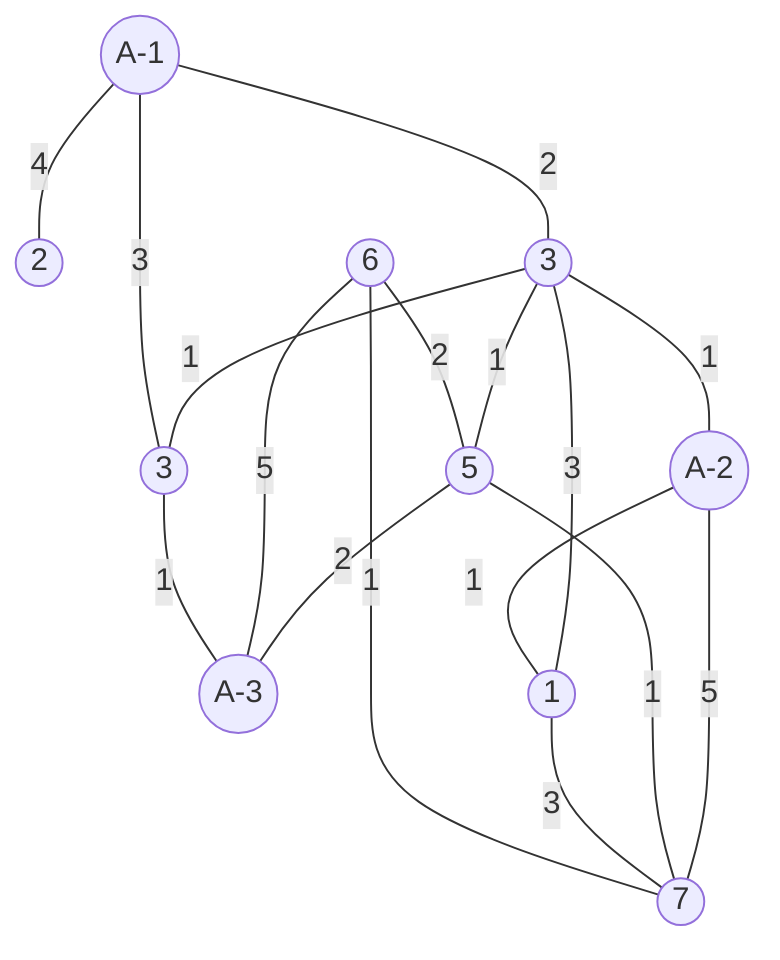

<center>
    <font size=10 face="黑体">
    Ambulance Dispatch
    </font>
</center>
<center>
    <font size = 5>
    Date:2021-11-21
    </font>
    <br>陶泓宇 3200103929
</center>


<div STYLE="page-break-after: always;"></div>

### Chapter 1: Introduction

---

​	Given a map of a city with all the ambulance dispatch centers and all the pick-up points. You should write a program to handle emergency calls. Suppose the caller is waiting at a pick-up point. You must notify the nearest (i.e. it takes the least amount of time to get to that location) dispatch center if there is at least one ambulance available at that center. Note: Centers that do not have any ambulances cannot be considered.

​	If your choice is not unique, notify the center with the most ambulances. If there is still a tie, choose the one that can reach the location via the least number of streets, guaranteed to be unique.

### Chapter 2: Algorithm Specification

---

​	The program uses Dijkstra's algorithm to obtain the shortest distance and path from each request point to the ambulance dispatch center. After obtaining the shortest distance and the shortest path array, a multi-layer nested for loop is used to filter the ambulance dispatch centers that do not meet the conditions, and finally the paths that meet the conditions are output.

​	The entire program calls the following functions:

```c
void scan(int* Na,int* Ns,int* Num,int map[][100],int* request,int* requestArray)
void Dijkstra(int map[][100],int start,int verticeNum,int* minDistance,int* path)
void judge(int* minDistance,int* Num,int* path,int* requestArray,int num,int Ns,int* print)
void output(int verticeNum,int map[][100],int* requestArray,int* path,int* minDistance,int Ns,int* Num)
```

​	For the function `scan`, The main function is to scan the input and store the input diagram as a two-dimensional matrix in an array Na indicates the number of request points, Ns indicates the number of dispatch centers, the Num array stores the number of vehicles per dispatch center, and request indicates the array of request points

​	Foe the function `Dijkstra`, The main function is to calculate the shortest distance from each point to the dispatch center using Dijkstra's algorithm map represents a graph represented as a two-dimensional matrix, start represents the start point, end represents the end point, minDistance represents the distance array, path represents the path array

​	for the function `judge`, The main function of the function is to determine which dispatch centre to choose to dispatch a vehicle, the rules are as follows

- Select the dispatch center with the remaining vehicles
- Select the dispatch center that takes the shortest time
- Select the dispatch center that has the least number of streets to pass through

​	The minDistance array represents the shortest time from each point to the start point, the path array represents the shortest path from each point to the start point, the Num array represents the number of vehicles at each dispatch center, Ns represents the number of dispatch centers (numbered from 1), and requestArray[num] represents the number of the requested point. 

​	We need to select the dispatch center of the car according to the above rules, for each car dispatched, Num[i]--,i means the dispatch center number, and output the dispatch center number of the car in the judge function, the dispatch center of the car should first meet the car (Num[i]>0), and then meet the shortest time, if there are multiple dispatch points with the same time, the dispatch point with more cars left is preferred. If there are more than one dispatch point with more cars left, the dispatch point with the least number of streets will be chosen first.

​	for the function `output`, The function outputs the array sorted according to the dijkstra algorithm

### Chapter 3: Testing Results

---

​	Using the sample input:

```
7 3
3 2 2
16
A-1 2 4
A-1 3 2
3 A-2 1
4 A-3 1
A-1 4 3
6 7 1
1 7 3
1 3 3
3 4 1
6 A-3 5
6 5 2
5 7 1
A-2 7 5
A-2 1 1
3 5 1
5 A-3 2
8
6 7 5 4 6 4 3 2
```


​	the output is as follows:


### Chapter 4: Analysis and Comments

---

##### time complexity

​	The dijkstra algorithm uses a double for loop to traverse every point in the graph, so the average time complexity is O(n^2)

​	However, if we consider the case that the number of ambulance dispatch centers is much larger than the request point, assuming that for the request point, the time from each ambulance dispatch center to the request point, the number of streets passed, and the number of ambulances owned are all the same, we can find that the time complexity can be up to O(n^4) according to the multi-layer nesting in the judge function

In summary, the average time complexity is still O(n^2) because the above case is difficult to implement

##### space complexity

​	Since the method of representing the graph as a two-dimensional array is used, for a graph with n nodes, an array of [n][n] needs to be created to represent the graph, so the space complexity of the algorithm is O(n^2)

### Declaration

​	**I hereby   declare   that   all   the   work   done   in   this   project   titled "Ambulance Dispatch" is of my independent effort.**

### Appendix

```c
#include<stdio.h>
int printIndex = 0;
int numReturn = -1;

/*
函数名：scan
函数功能：扫描输入，并将输入的图以二维矩阵的形式存储在数组中
函数参数：Na表示请求点的数量，Ns表示派遣中心的数量，Num数组储存每个派遣中心的车的数量，request表示请求点数组
*/
void scan(int* Na,int* Ns,int* Num,int map[][100],int* request,int* requestArray){
    scanf("%d",Na);
    scanf("%d",Ns);
    int max;
    for(int i=0;i<*Ns;i++){
        scanf("%d",&Num[i]);
    }
    scanf("%d",&max);
    for(int i = 0;i<max;i++){
        char ch = getchar();
        ch = getchar();
        if(ch == 'A'){//如果第一个输入是A
            ch = getchar();//去除-;
            int x,y,time;
            scanf("%d %d %d",&x,&y,&time);
            //printf("%d %d %d\n",x,y,time);
            map[x][y+*Ns] = time;
            map[y+*Ns][x] = time;
        }
        else{
            int x = ch - '0';
            ch = getchar();
            ch = getchar();
            if(ch == 'A'){//如果第二个是A开头
                ch = getchar();
                int y,time;
                scanf("%d %d",&y,&time);
                //printf("%d %d %d\n",x,y,time);
                map[x+*Ns][y] = time;
                map[y][x+*Ns] = time;
            }
            else{
                int y = ch - '0';
                int time;
                scanf("%d",&time);
                //printf("%d %d %d\n",x,y,time);
                map[x+*Ns][y+*Ns] = time;
                map[y+*Ns][x+*Ns] = time;
            }
        }
    }
    //输入请求点
    scanf("%d ",request);
    for(int i=0;i<*request;i++){
        scanf("%d",&requestArray[i]);
    }
}

/*
函数名：Dijkstra
函数功能：Dijkstra算法，计算每个点到派遣中心的最短距离
函数参数：map：以二维矩阵形式表示的图，start：起始点，end：终点，minDistance：距离数组，path：路径数组
*/
void Dijkstra(int map[][100],int start,int verticeNum,int* minDistance,int* path){
    //int minDistance[100];//记录原点到各点的最短距离
    int min = 100,minIndex;
    int visited[100] = {0};//记录该点是否已经是最短路径
    minDistance[start] = 0;//起始点到起始点的距离为0
    visited[start] = 1;//起始点到起始点是最短路径
    //dijiestra算法
    for(int i = 0;i<verticeNum;i++){
        if(map[start][i] == 0){
            minDistance[i] = 10000;
        }
        else{
            minDistance[i] = map[start][i];
        }
    }

    for(int i=0;i<verticeNum;i++){
        min = 100;//初始化最小距离为100
        for(int j=0;j<verticeNum;j++){//遍历所有点
            if(!visited[j] && minDistance[j]<min){//如果该点未被访问过且距离小于最小距离
                min = minDistance[j];//更新最小距离
                minIndex = j;//记录最小距离的点
            }
        }
        //printf("minIndex = %d, min = %d\n",minIndex,min);

        visited[minIndex] = 1;//将最小距离的点设置为已访问
        for(int j=0;j<verticeNum;j++){//遍历所有点
            if(!visited[j] && map[minIndex][j]>0 && minDistance[minIndex]+map[minIndex][j]<minDistance[j]){//如果该点未被访问过且距离小于最小距离
                minDistance[j] = minDistance[minIndex]+map[minIndex][j];//更新最小距离
                path[j] = minIndex;//记录最小距离的点
               // printf("path[%d] = %d\n",j,minIndex);
            }
        }
    }
}

/*
判断选择哪个派遣中心出车，判断规则如下
1、选取有车剩余的派遣中心
2、选取耗时最短的派遣中心
3、选取经过街道数目最少的派遣中心
num表示接车点的编号
函数输入：minDistance数组表示每个点到起始点的最短时间，path数组表示每个点到起始点的最短路径，
        Num数组表示每个派遣中心点的车辆数目,Ns表示派遣中心的数量(从1开始编号)
        requestArray[num]表示请求点的编号
要求：根据上述几条规则选择出车的派遣中心，每派出一辆车，Num[i]--,i表示派遣中心编号,并在judge函数中输出出车的派遣中心编号，
        出车的派遣中心首先要满足有车(Num[i]>0)，然后要满足耗时最短，如果有多个出车点耗时相同，
        则优先选择剩余车多的出车点，
        如果剩余车多的出车点还有多个，则优先选择经过街道数目最少的出车点。
*/
void judge(int* minDistance,int* Num,int* path,int* requestArray,int num,int Ns,int* print){
    int flag[100][100];
    int res = 0;
    int ALLBUSY = 1;
    int minStrPassed = 100;//minStreetPassedCenter
    int minStrPassedCenter = 0;
    int minStrPassedCenterArray[100];
    int strPassedCount[100];
    for(int i = 0;i<100;i++)
        strPassedCount[i] = 0;
    //初始化flag数组
    for(int i = 0;i<Ns;i++){
        if(Num[i] > 0){
            flag[0][i+1] = 1;
            ALLBUSY = 0;
        }
        else{
            flag[0][i+1] = 0;
        }
    }
    if(ALLBUSY == 1){
        print[printIndex++] = 0;
        printf("all busy\n");  
        return;      
    }

    //初始化minStrPassedCenterArray数组
    int carLeftCenter[100];
    int carLeftIndex = 0;
    //初始化carLeftCenter数组
    for(int i = 0;i<Ns;i++){
        if(Num[i] > 0)
            carLeftCenter[carLeftIndex++] = i;
    }
    //如果没有中心有车则print all busy
    if(carLeftIndex == 0){
        print[printIndex++] = 0;
        printf("all busy\n");
        return;
    }
    else{//如果中心有车
    int minTime = 100;
    int minTimeCenter = 0;//时间最短的中心的数量
    int minTimeArray[100];//储存具有最短时间中心的数组
    for(int i = 0;i<carLeftIndex;i++){
        if(minDistance[carLeftCenter[i]+1] < minTime)
            minTime = minDistance[carLeftCenter[i]+1];
    }
    for(int i = 0;i<carLeftIndex;i++){
        if(minDistance[carLeftCenter[i]+1] == minTime){
            flag[1][carLeftCenter[i]+1] = 1;
            minTimeArray[minTimeCenter++] = carLeftCenter[i]+1;
            //printf("flag[1][%d] = 1\n",i+1);
        }
        else{
            flag[1][carLeftCenter[i]+1] = 0;
        }
    }
    if(minTimeCenter == 1){//如果只有一个中心时间最短
        Num[minTimeArray[0]-1]--;
        printf("A-%d",minTimeArray[0]);
        int j = minTimeArray[0];
            while (path[j] != 0){
                printf("->%d",path[j]-3);
                j = path[j];
                //printf("----------%d--------------",i-3);   
            }
            printf("->%d\n",requestArray[num-1]);
        numReturn = minTimeArray[0];
        print[printIndex++] = minTimeArray[0];
        return;
    }
    else {//如果有多个中心时间最短
        int maxCar = -100;
        int maxCarCenter = 0;//具有最多车的中心
        int maxCarArray[100];//储存具有最多车中心的数组
        for(int i = 0;i<minTimeCenter;i++){
            if(Num[minTimeArray[i]-1] > maxCar)
                maxCar = Num[minTimeArray[i]-1];                
        }
        for(int i = 0;i<minTimeCenter;i++){
            if(Num[minTimeArray[i]-1] == maxCar){
                maxCarArray[maxCarCenter++] = minTimeArray[i];
            }
        }
        if(maxCarCenter == 1){//如果只有一个中心最多车
            Num[maxCarArray[0]-1]--;
            printf("A-%d",maxCarArray[0]);
            int j = maxCarArray[0];
            while (path[j] != 0){
                printf("->%d",path[j]-3);
                j = path[j];
                //printf("----------%d--------------",i-3);   
            }
            printf("->%d\n",requestArray[num-1]);
            numReturn = maxCarArray[0];
            print[printIndex++] = maxCarArray[0];
            return;
        }
        else if(maxCarCenter > 1){//如果有多个中心最多车
            /*
            int minStrPassed = 100;//minStreetPassedCenter
            int minStrPassedCenter = 0;
            int minStrPassedCenterArray[100];
            int strPassedCount[100];
            */
            for(int i = 0;i<maxCarCenter;i++){
                int j = maxCarArray[i];
                while(path[j] != 0){
                    j = path[j];
                    strPassedCount[maxCarArray[i]]++;
                }
                //printf("strPassedCount[%d] = %d\n",maxCarArray[i],strPassedCount[maxCarArray[i]]);
            }
            for(int i = 0;i<maxCarCenter;i++){
                if(strPassedCount[maxCarArray[i]] < minStrPassed)
                    minStrPassed = strPassedCount[maxCarArray[i]];
            }
            for(int i = 0;i<maxCarCenter;i++){
                if(strPassedCount[maxCarArray[i]] == minStrPassed){
                    printf("A-%d",maxCarArray[i]);
                    int j = maxCarArray[i];
                    while (path[j] != 0){
                    printf("->%d",path[j]-3);
                    j = path[j];
                    //printf("----------%d--------------",i-3);   
                    }
                    printf("->%d\n",requestArray[num-1]);
                    print[printIndex++] = maxCarArray[i];
                    Num[maxCarArray[i]-1]--;
                    numReturn = maxCarArray[i];
                    return;
                }
            }
        }
    }
    }
}

/*
函数名：output
函数功能：根据dijkstra算法排序以后的数组
*/
void output(int verticeNum,int map[][100],int* requestArray,int* path,int* minDistance,int Ns,int* Num){
    int print[100];
   for(int i = 4;i<verticeNum+1;i++){
        Dijkstra(map,requestArray[i-4]+Ns,verticeNum,minDistance,path);
        //printf("对于第%d个请求点:\n",i-3);
        for(int k = 1;k<4;k++){
            //printf("    到A-%d的最短时间为：%d,路径为:A-%d",k,minDistance[k],k);
            int j = k;
            //while (path[j] != 0){
                //printf("->%d",path[j]-3);
                //j = path[j];
                //printf("----------%d--------------",i-3);   
            //}
            //printf("->%d",requestArray[i-4]);            
            //printf("\n");
        }
        numReturn = -1;
        judge(minDistance,Num,path,requestArray,i-3,Ns,print);
        if(numReturn != -1)
            printf("%d\n",minDistance[numReturn]);
        for(int i = 0;i<100;i++)
            path[i] = 0;        
    }   
}

int main(){
    int Na,Ns,Num[100] = {0};//Num[i]表示第i个派遣中心的车辆数
    int map[100][100];//map[i][j]表示从i到j的距离
    int request,requestArray[100];//requestArray[i]表示第i个请求点
    scan(&Na,&Ns,Num,map,&request,requestArray);//输入
    //test
    //printf("一共有%d个接车点\n",Na);
    //printf("一共有%d个救护中心\n",Ns);
    //for(int i=0;i<Ns;i++){
      //  printf("第%d个救护中心有%d辆车\n",i+1,Num[i]);
    //}
    //test map
    //for(int i = 1;i<Na+Ns+1;i++){
      //  for(int j = 1;j<Na+Ns+1;j++){
        //    printf("%d ",map[i][j]);
        //}
        //printf("\n");
    //}
    //map中1-Na为救护中心，Na-Na+Ns为接车点

    //test request
    //printf("一共有%d个请求点\n",request);
    //for(int i=0;i<request;i++){
      //  printf("第%d个请求点是%d\n",i+1,requestArray[i]);
    //}

    int minDistance[100];
    int path[100] = {0};
    int verticeNum = Na+Ns+1;//图中顶点数

    output(verticeNum,map,requestArray,path,minDistance,Ns,Num);//输出
}
```

