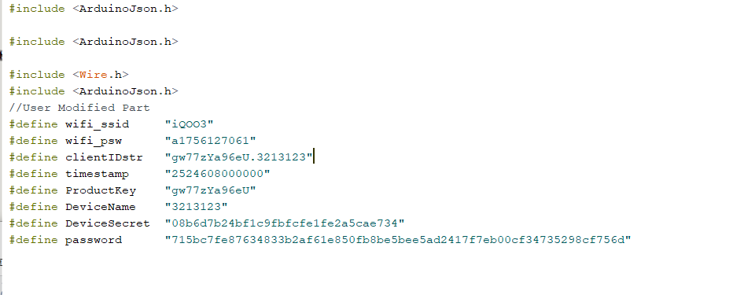
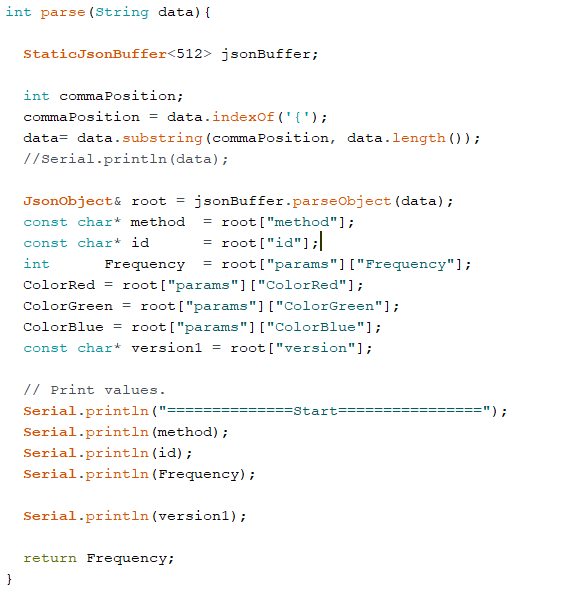
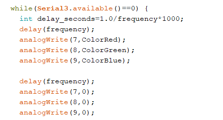
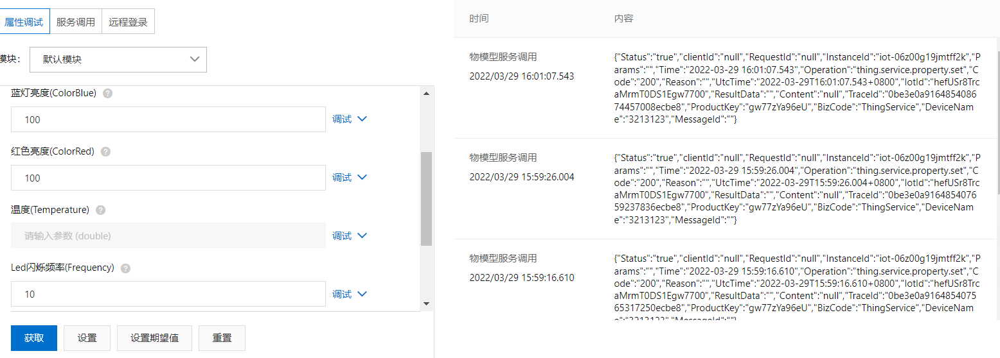
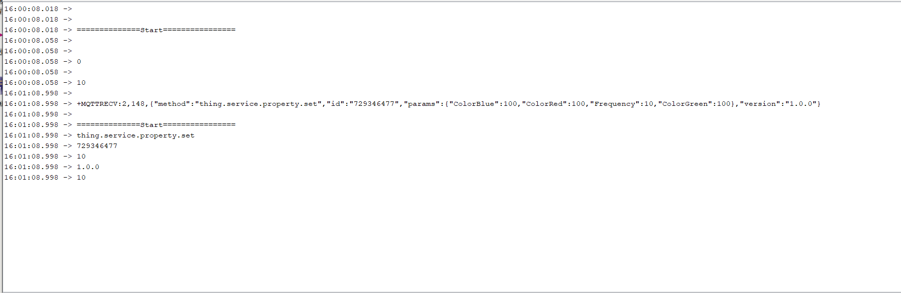
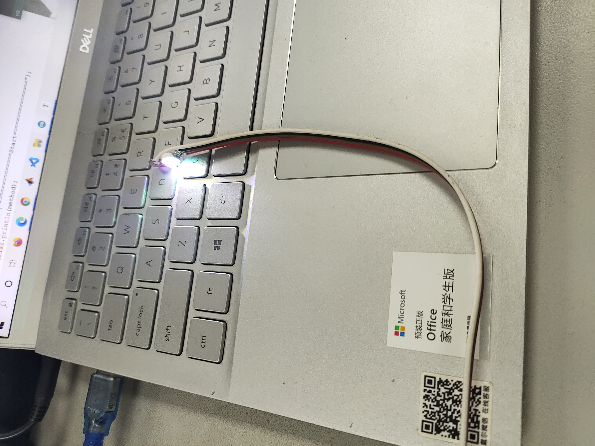
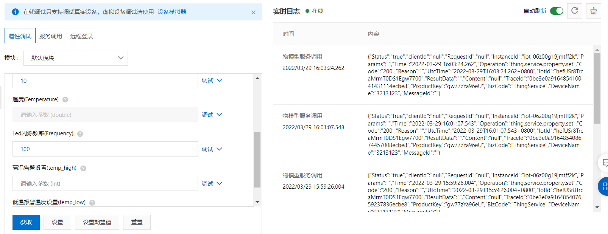
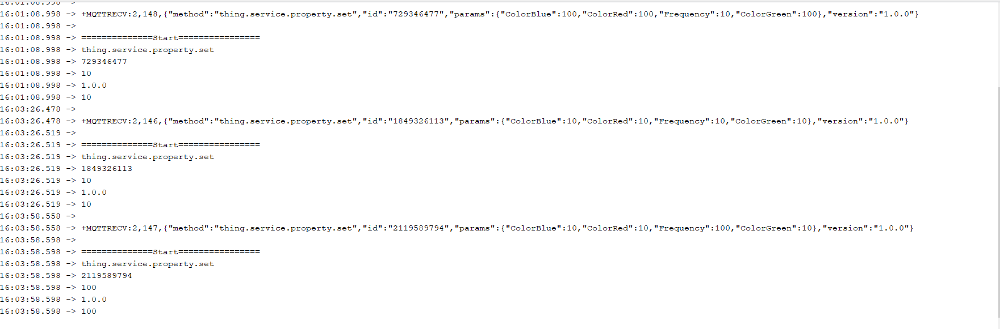

# HW 3

1、首先根据第二次作业的指令修改#define部分

2、修改`arduino`的缓冲区大小

3、修改`parse`函数中的缓冲区大小

4、修改部分代码以实现PWM调光

5、打开串口监视器，上传arduino文件；在阿里云平台上下发如下数据

在串口监视器上收到如下消息

灯光效果如下

6、修改闪烁频率

在串口监视器上收到如下消息

同时可以观察到灯光闪烁频率变慢

