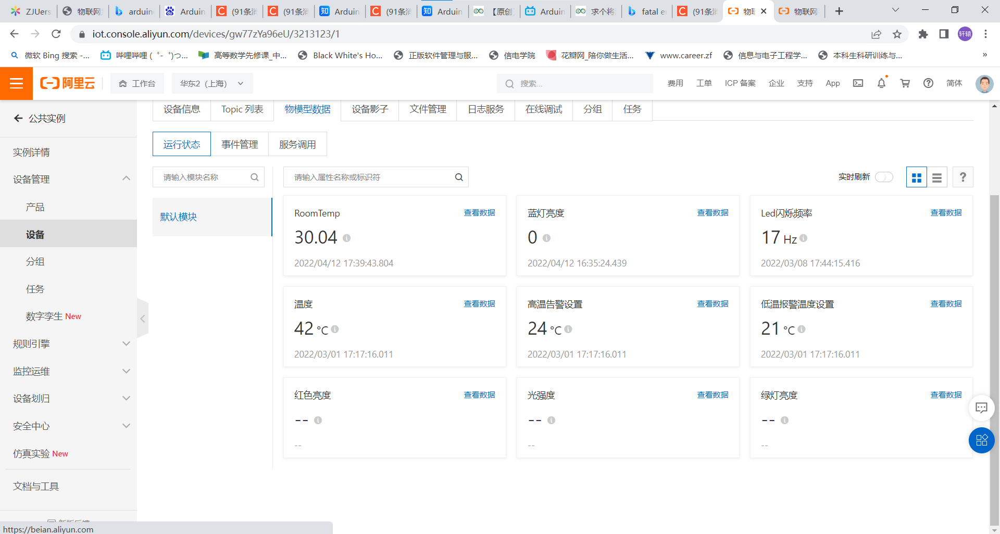
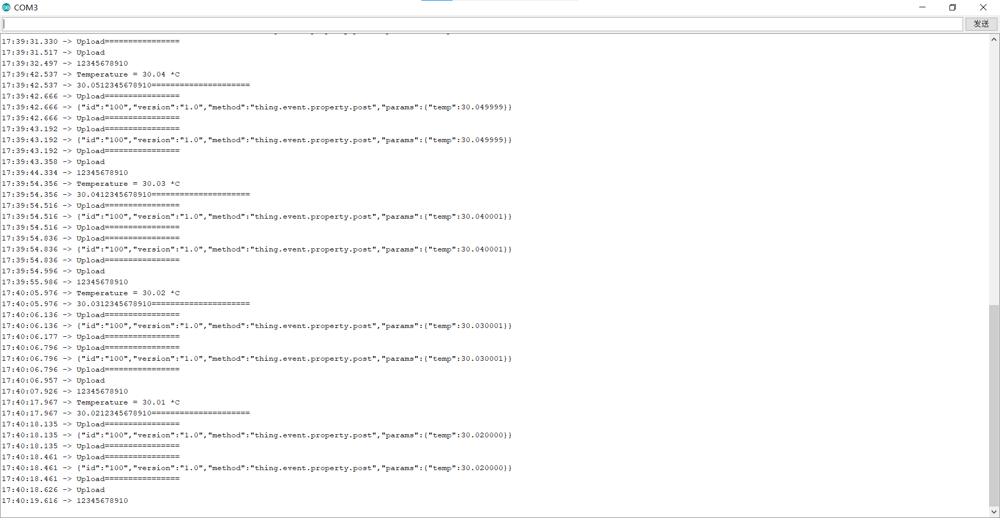

# HW 4

1. 使用如下代码读取温度

   ```c
       /* Default settings from datasheet. */
     bmp.setSampling(Adafruit_BMP280::MODE_NORMAL,     /* Operating Mode. */
                     Adafruit_BMP280::SAMPLING_X2,     /* Temp. oversampling */
                     Adafruit_BMP280::SAMPLING_X16,    /* Pressure oversampling */
                     Adafruit_BMP280::FILTER_X16,      /* Filtering. */
                     Adafruit_BMP280::STANDBY_MS_500); /* Standby time. */
   ```

2. 修改定义的`JSON_DATA_PACK`为`{\"id\":\"100\",\"version\":\"1.0\",\"method\":\"thing.event.property.post\",\"params\":{\"temp\":%f}}\r"`

3. 由于arduino中直接上传浮点数会导致输出?号，因此我们需要修改编译选项，在` \arduino-1.8.3\hardware\arduino\avr\platform.txt`路径下修改platform.txt文件，加入以下两行代码

   ```c
   # %f support for printf/sprintf
   compiler.c.elf.extra_flags=-Wl,-u,vfprintf -lprintf_flt -lm
   ```

   这样可以解决上传浮点数时输出问号的问题

4. 在upload函数后设置delay(10000),设置为每10秒上传一次

5. 上传程序，阿里云上的的结果如下：

   

   串口监视器的结果如下

   

6. 可以观察到阿里云成功接收到了数据

