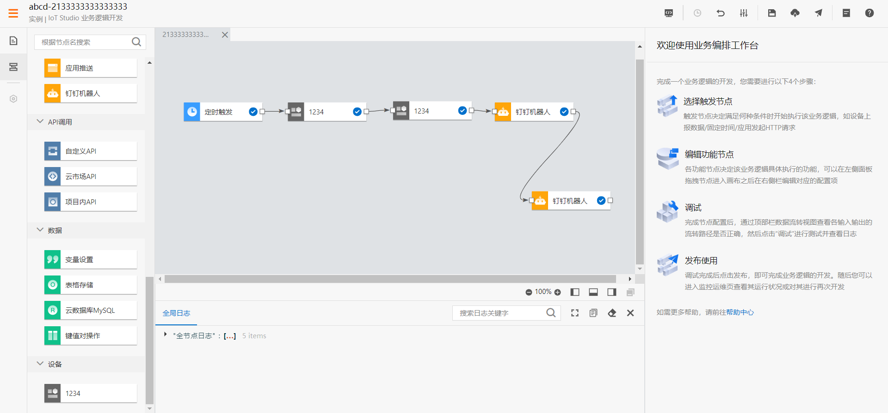
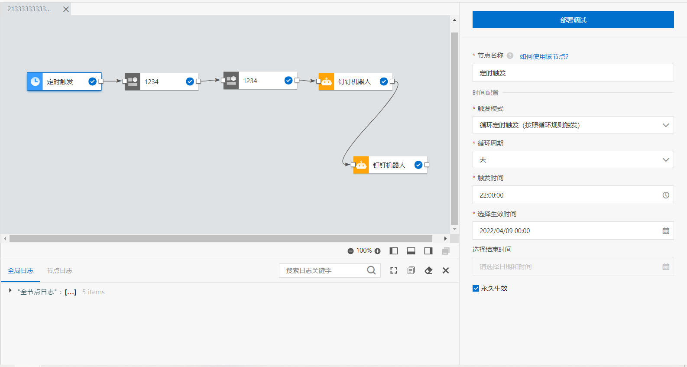
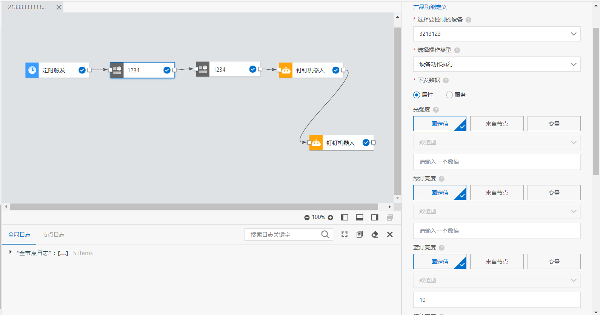
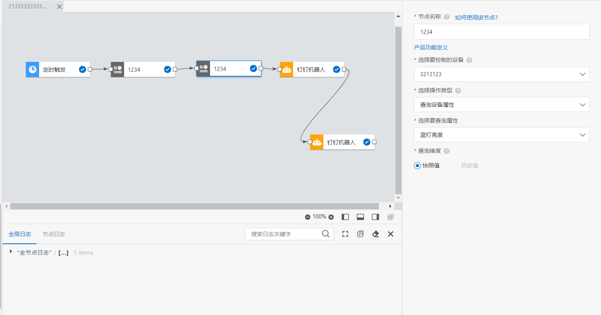
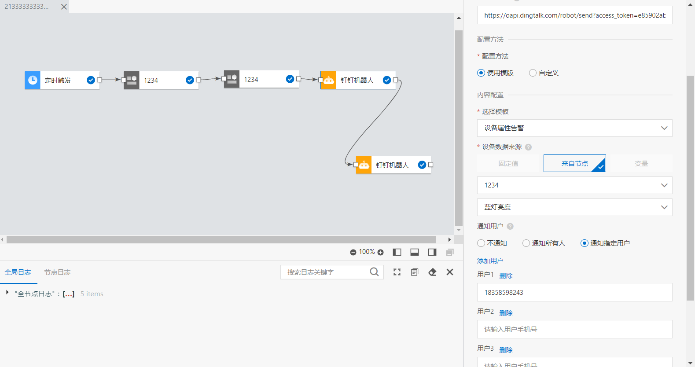
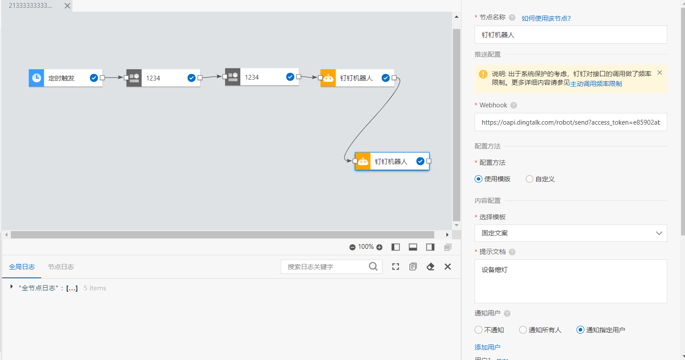
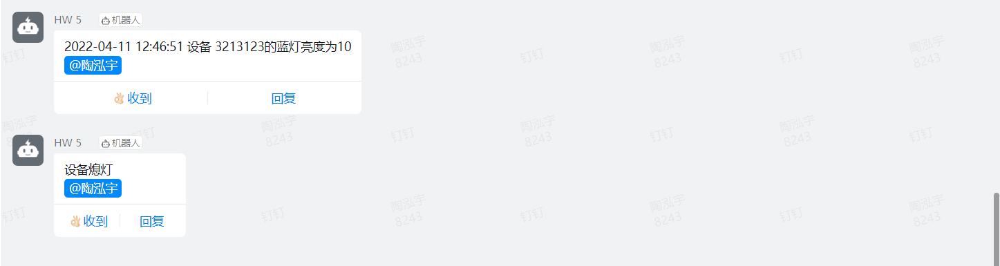
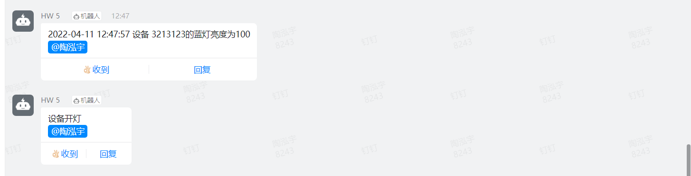

# HW 5

1. 首先在`wifi3_change_fre_end`文件中修改`define`如下，使得设备能够连接到阿里云

   ```c
   //User Modified Part
   #define wifi_ssid     "iQOO3"    
   #define wifi_psw      "a1756127061"     
   #define clientIDstr   "gw77zYa96eU.3213123"
   #define timestamp     "998"
   #define ProductKey    "gw77zYa96eU"
   #define DeviceName    "3213123"
   #define DeviceSecret  "08b6d7b24bf1c9fbfcfe1fe2a5cae734"
   #define password      "4A7321E76D3CF06B90F9824B1882FFE9C10B134E"
   ```

2. 增加`upload`函数，使得设备端的信息可以上传到阿里云，upload函数如下

   ```c
   bool Upload()
   {
     bool flag;
     int len;
   
     //int  PhotoResistors=ColorBlue;
     cleanBuffer(ATcmd,BUF_LEN);
     // snprintf是sprintf的安全版本，当输入的字符大于size-1时会将后面的字符丢弃。而返回值为字符串的真实长度。
     snprintf(ATcmd,BUF_LEN,AT_MQTT_PUB_SET,ProductKey,DeviceName);//将ProductKey,DeviceName赋值给AT_MQTT_PUB_SET里面的变量后，拷贝给ATcmd。不超过AT_MQTT_PUB_SET 100的长度
     flag = check_send_cmd(ATcmd,AT_OK,DEFAULT_TIMEOUT);
      
     cleanBuffer(ATdata,BUF_LEN_DATA);
     len=snprintf(ATdata,BUF_LEN_DATA,JSON_DATA_PACK,ColorBlue);
       
     cleanBuffer(ATcmd,BUF_LEN);
     snprintf(ATcmd,BUF_LEN,AT_MQTT_PUB_DATA,len-1);
     
     flag = check_send_cmd(ATcmd,">",DEFAULT_TIMEOUT);  //检测是否有“>”回应
     if(flag) flag = check_send_cmd(ATdata,AT_MQTT_PUB_DATA_SUCC,20);
     return flag;
   }
   ```

   同时我们需要修改define的`JSON_DATA_PACK`，将其中传递的参数名改为灯的名字，这样子传上去的json数据才能被接收`#define JSON_DATA_PACK        "{\"id\":\"100\",\"version\":\"1.0\",\"method\":\"thing.event.property.post\",\"params\":{\"ColorBlue\":%d}}\r"`

3. 由于一个业务逻辑中只能有一个定时触发，我们需要在iot studio中建立两个业务逻辑，一个负责开灯，一个负责关灯

4. 负责关灯的业务逻辑流程图及各个节点参数如下

   

   

   

5. 负责开灯的业务逻辑也类似，区别是将第一个触发节点的触发时间改成7:00，设备动作执行中将蓝灯亮度改为100

6. 执行结果如下：

   

​	

