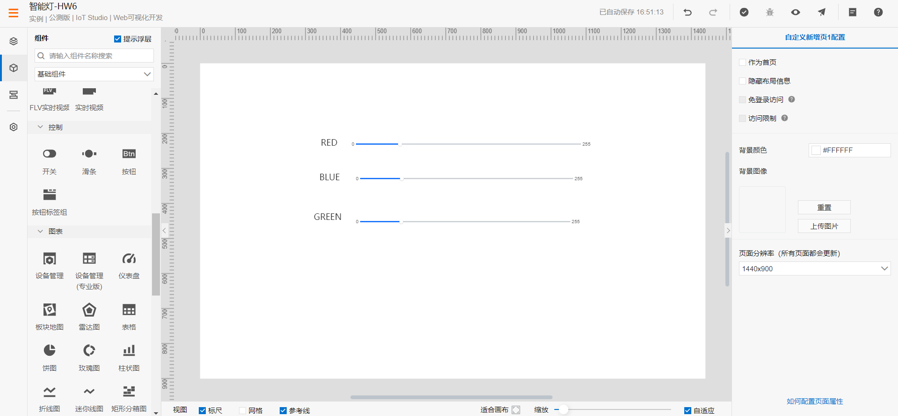
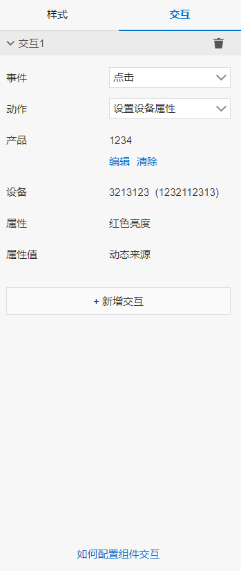
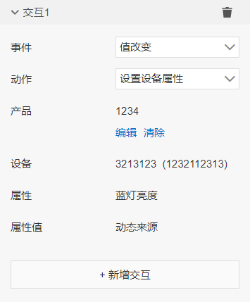
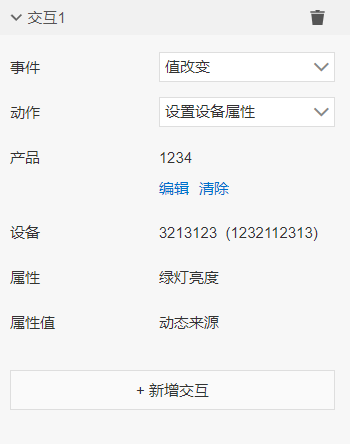
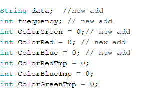
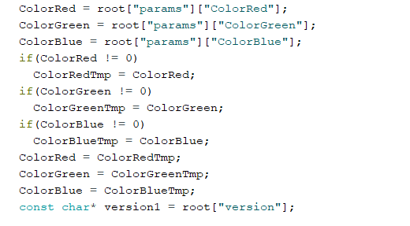
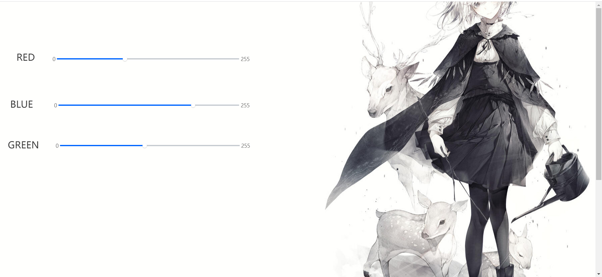
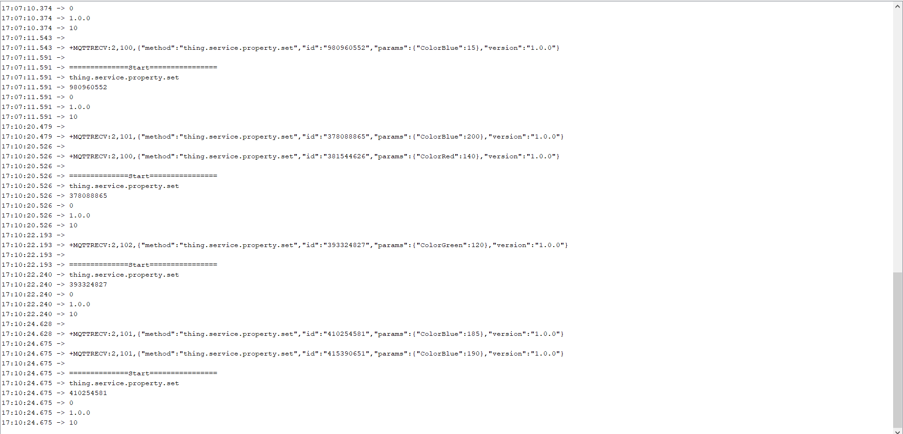
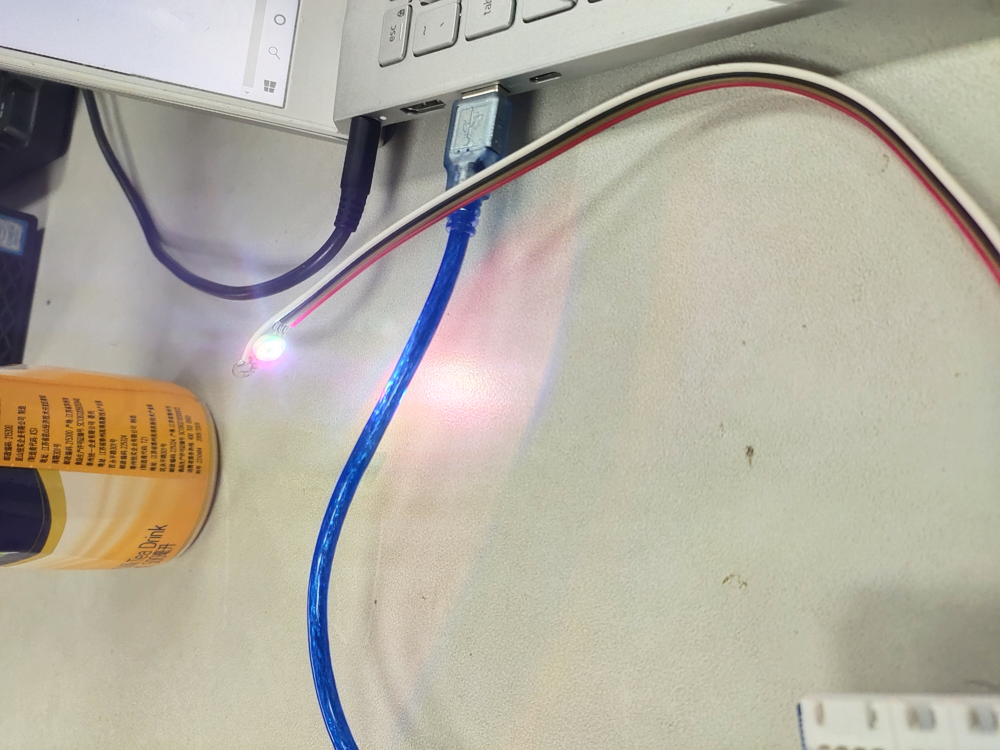

# HW 6

1、进入IoT Studio，设置如下组件：

各个滑动条的交互设置如下：

RED滑动条：

BLUE滑动条

GREEN滑动条：

2、修改arduino代码，

增加`ColorRedTmp`、`ColorBlueTmp`、`ColorGreenTmp`,以适应IoT Studio开发的应用一次只能传递一个属性的值

3、在IoT Studio中点击预览，得到如下界面

修改BLUE滑动条，COM3串口接收到的信息如下

显示效果如下

