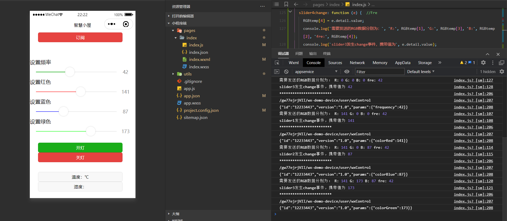
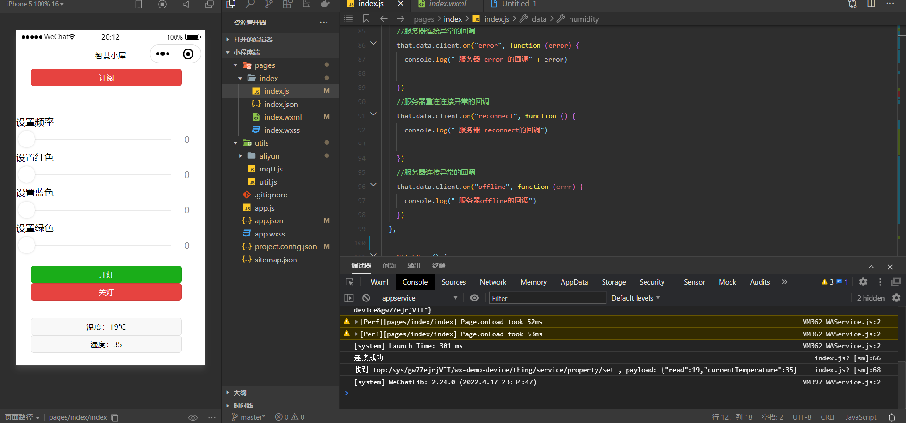

1. 新建一个用于控制微信小程序的产品

2. 在产品中加入如下属性：

   

3. 在index.js中写入如下参数以连接阿里云平台，参数与连接结果如下

   

4. 修改`sendCommand`函数如下，根据传入的command确定sendData的种类，由于JavaScript中let声明会形成暂时性死区，所以要将let改为var，通过var的变量提升来解决问题

   ```javascript
   sendCommond(cmd, data) {
       if(cmd === 'colorRed'){
         var sendData = {
           id: '12233443',
           version: '1.0',
           params:{
           //temp: RGBtemp[1],
           //humidity: RGBtemp[3]
             colorRed:  data,
           }
         };
       }
       else if(cmd === 'colorBlue'){
         var sendData = {
           id: '12233443',
           version: '1.0',
           params:{
             colorBlue:  data,
           }
         };
       }
       else if(cmd === 'colorGreen') {
         var sendData = {
           id: '12233443',
           version: '1.0',
           params:{
             colorGreen:  data,
           }
         };
       }
       else if(cmd === 'off') {
         var sendData = {
           id: '12233443',
           version: '1.0',
           params:{
             colorGreen:  0,
             colorRed: 0,
             colorBlue: 0
           }
         };
       }
       else if(cmd === 'on') {
         var sendData = {
           id: '12233443',
           version: '1.0',
           params:{
             colorGreen:  255,
             colorRed: 255,
             colorBlue: 255
           }
         };
       }
       else {
         var sendData = {
           id: '12233443',
           version: '1.0',
           params:{
             temp: RGBtemp[1],
             humidity: RGBtemp[3],
           }
         };
       }
       //发布消息
       if (this.data.client && this.data.client.connected) {
         this.data.client.publish(this.data.aliyunInfo.pubTopic, JSON.stringify(sendData));
         console.log("************************")
         console.log(this.data.aliyunInfo.pubTopic)
         console.log(JSON.stringify(sendData))
       } else {
         wx.showToast({
           title: '请先连接服务器',
           icon: 'none',
           duration: 2000
         })
       }
     },
   ```

   点击开灯按钮，控制台输出如下

   

5. 在各个slide函数中加入以下代码以实现拖动滑动条时发送数据，发送结果如下

   

6. 创建云产品流转规则以实现将阿里云收到的微信的数据转发到arduino上

   

7. 测试结果，在小程序上点击开灯，arduino结果如下

   

8. 接下来进行将arduino上接收到的数据转发到微信的工作，先创建一个云服务流转规则以下发数据

   

9. 在阿里云上发布如下信息

   

10. 微信小程序收到的结果如下

    

